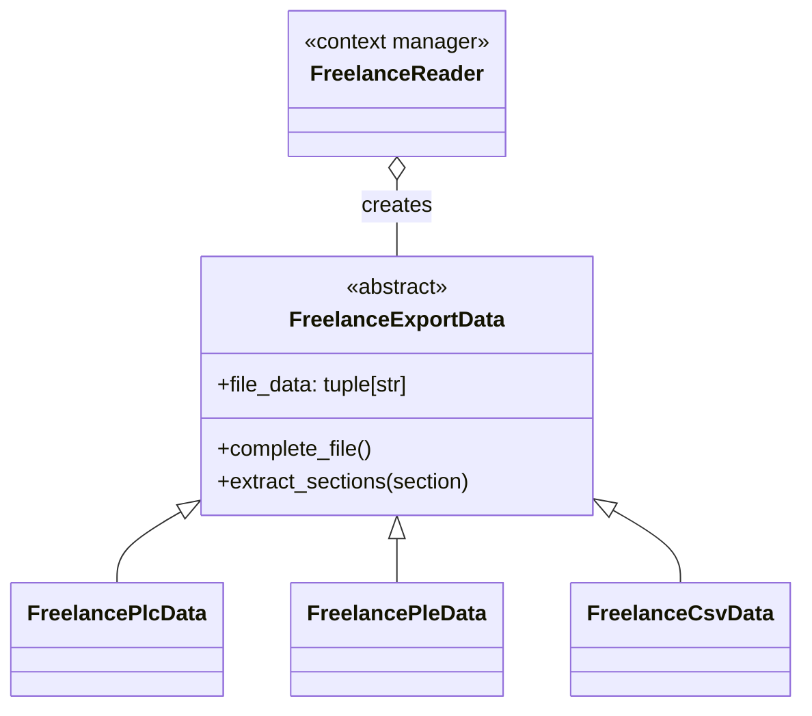

# FreecomAPI

[](https://www.python.org/downloads/release/python-3100/)
[](https://badge.fury.io/py/freelanceapi)
[](https://github.com/DarkJumper/FreelanceAPI/blob/main/LICENSE)

With the Freelance API an export file from the ABB Freelance control system can be evaluated.


## Freelance Reader

The ```FreelanceReader``` is a context manager. Depending on the file extension it returns the correct object
:warning: Only certain file endings are evaluated
- PLC
- PLE
- CSV

### FreelanceReader

```
from freelanceapi import FreelanceReader

with FreelanceReader("/User/test.csv") as file:
    print(file)

output >> freelanceapi.FreelanceExportData.FreelanceCsvData object at 0x10e13eac0
```

## Freelance Exports
The Freelance Export class supports the functions.

### complete_file
The data of the complete file is returned as a tuple.
```
from freelanceapi import FreelanceReader

with FreelanceReader("/User/test.csv") as file:
    print(file.complete_file())

output >> (([Program-Generated File -- DO NOT MODIFY],),([DUMP_VERSION],2061,),([DUMP_FILETYPE],101,)......)
```

### extract_sections
The desired range must be specified as a string. Then the selected range is output as a tuple.
If a section occurs more than once in the file, it is expanded in the tuple.
```
from freelanceapi import FreelanceReader

with FreelanceReader("/User/test.csv") as file:
    print(file.extract_sections("Project Comment"))
    
output >> (('[BEGIN_PROJECTCOMMENT];0;',),)
```
The following areas are available for selection:
- Project Comment
- Node
- HW2
- Area
- Header
- Resorce Association
- Hardware Manager
- Hardware
- OPC Connection
- Connections
- HD Text
- HD
- MSR
- OPC Adressing
- EAM Initialisation
- EAM
- Project Tree

### Freelance Export UML



In this example, the complete range of field IO is output.

The following sections can be read out:
- ProjectComment:
- AreaDefinition:
- ProjectHeader:
- ResourceAssociation:
- HardWareManager:
- HW2:
- OPCConn:
- Conn:
- HDTextList:
- HD:
- MSR:
- OPCAdress:
- EAMInit:
- EAM:
- Node:
- Pbaum:

### row_identifier 

## It provides:

Meanings of the Dict Keys:
- ID: Identification
- RID: Row Identification
- LEN: Length of Dataset
- NA: Next element available
- MP: Measuring point
- MT: Module Type
- ST: Short Text
- LT: Long Text
- AD: Area Definition
- SB: Status Bit
- VN: Variable Name
- DT: Data Typ
- VT: Variable Text
- PI: Process image
- EX: Exported Variable
- VC: Variable(0) or Const (1)
- FB: FBS Name
- LB: Libary
- DTMN: DTM Number
- DTMC: DTM Config
- QC: Quantity counter
- FN: Function Name
- CN: Channel Name
- IO: Input or Output
- UB: Used Byte
- B: Bit
- BL: Byte Length
- C: Commend
- AC: Area Char
- LA: Length of Area Text
- AN: Area Name
- PO: Processing order
- VAR: Variable

## :warning: Developer Info

All keys that contain a NI (NoIdear) cannot be assigned to a function.


